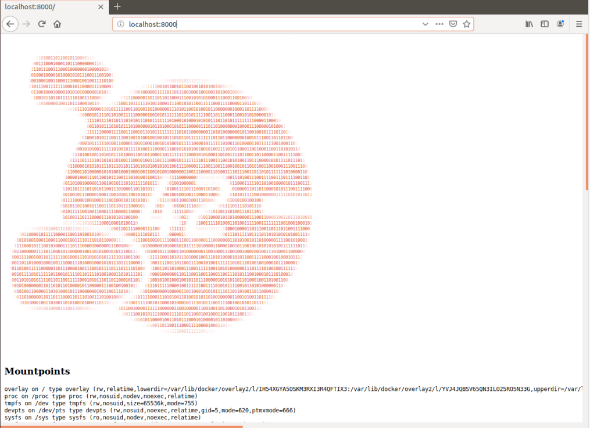

# Homework #1

В качестве первого задания было предложено познакомиться с kubernetes через его дистрибутив [Minikube](https://kubernetes.io/docs/tasks/tools/install-minikube/).

Команда `minikube start` героически съела все место на виртуалке с убунтой, почле чего я ее героичеки восстановил.

Кстати, я добавил алиас для kubect: `alias k=kubectl` - очень удобно

Потом я посмотрел на cluster-info, посмотрел внутри на виртуалку minikube, посмотрел как вселенные внутри кубернетиса встают и рушатся, 
когда мы убивали все поды из ns kube-system.

Насколько я понял, coredns развернут с помощью deployment, поэтому, что бы не случилось с подами coredns, они придут к тому состоянию, что описано в Deployment
kube-proxy-rxbtr развернут с помощью DaemonSet и его поды будут развернуты на каждой машине кластера, если мы их все удалим

kube-apiserver
etcd
kube-scheduler
kube-controller-manager

Это компоненты мастера, составляющие Control Plane. Их манифесты по умолчанию лежат в /etc/kubernetes, /etc/kubernetes/manifests и восстанавливаются из них при удалении.

storage-provisioner - это addon, его yaml лежит в /etc/kubernetes/addons и восстанавливается оттуда.

Дальше я пытался создать docker image из Nginx, httpd, uhttpd, lighthttpd, но условие, 
при котором процесс в контейнере должен работать от юзера с UID 1001, вызывал каждый раз какие-то косяки, 
устранение которых делало докер-файл ужасным. В итоге я остановился на питоновском SimpleHTTPServer.
Собрал образ и запушил его на докерхаб.

Дальше создал манифест для пода web-pod.yml, в котором описывается запуск контейера с моего образа,
а также инит-контейнер и волюмы для успешного запуска проекта.

Запустил это все дело командой 
```
k apply -f web-pod.yml
```

Затем прокинул порты командой

```
k port-forward --address 0.0.0.0 pod/web-pod 8000:8000
```

И наблюдал в браузере на виртуалке вот такую красоту:

